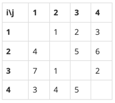

## 14889번 스타트와 링크

### 문제

오늘은 스타트링크에 다니는 사람들이 모여서 축구를 해보려고 한다. 축구는 평일 오후에 하고 의무 참석도 아니다. 축구를 하기 위해 모인 사람은 총 N명이고 신기하게도 N은 짝수이다. 이제 N/2명으로 이루어진 스타트 팀과 링크 팀으로 사람들을 나눠야 한다.

BOJ를 운영하는 회사 답게 사람에게 번호를 1부터 N까지로 배정했고, 아래와 같은 능력치를 조사했다. 능력치 Sij는 i번 사람과 j번 사람이 같은 팀에 속했을 때, 팀에 더해지는 능력치이다. 팀의 능력치는 팀에 속한 모든 쌍의 능력치 Sij의 합이다. Sij는 Sji와 다를 수도 있으며, i번 사람과 j번 사람이 같은 팀에 속했을 때, 팀에 더해지는 능력치는 Sij와 Sji이다.

N=4이고, S가 아래와 같은 경우를 살펴보자.



예를 들어, 1, 2번이 스타트 팀, 3, 4번이 링크 팀에 속한 경우에 두 팀의 능력치는 아래와 같다.

스타트 팀: S12 + S21 = 1 + 4 = 5
링크 팀: S34 + S43 = 2 + 5 = 7
1, 3번이 스타트 팀, 2, 4번이 링크 팀에 속하면, 두 팀의 능력치는 아래와 같다.

스타트 팀: S13 + S31 = 2 + 7 = 9
링크 팀: S24 + S42 = 6 + 4 = 10
축구를 재미있게 하기 위해서 스타트 팀의 능력치와 링크 팀의 능력치의 차이를 최소로 하려고 한다. 위의 예제와 같은 경우에는 1, 4번이 스타트 팀, 2, 3번 팀이 링크 팀에 속하면 스타트 팀의 능력치는 6, 링크 팀의 능력치는 6이 되어서 차이가 0이 되고 이 값이 최소이다.


예를 들어, 1, 2번이 스타트 팀, 3, 4번이 링크 팀에 속한 경우에 두 팀의 능력치는 아래와 같다.

스타트 팀: S12 + S21 = 1 + 4 = 5
링크 팀: S34 + S43 = 2 + 5 = 7
1, 3번이 스타트 팀, 2, 4번이 링크 팀에 속하면, 두 팀의 능력치는 아래와 같다.

스타트 팀: S13 + S31 = 2 + 7 = 9
링크 팀: S24 + S42 = 6 + 4 = 10
축구를 재미있게 하기 위해서 스타트 팀의 능력치와 링크 팀의 능력치의 차이를 최소로 하려고 한다. 위의 예제와 같은 경우에는 1, 4번이 스타트 팀, 2, 3번 팀이 링크 팀에 속하면 스타트 팀의 능력치는 6, 링크 팀의 능력치는 6이 되어서 차이가 0이 되고 이 값이 최소이다.

### 입력

첫째 줄에 N(4 ≤ N ≤ 20, N은 짝수)이 주어진다. 둘째 줄부터 N개의 줄에 S가 주어진다. 각 줄은 N개의 수로 이루어져 있고, i번 줄의 j번째 수는 Sij 이다. Sii는 항상 0이고, 나머지 Sij는 1보다 크거나 같고, 100보다 작거나 같은 정수이다.


### 출력

첫째 줄에 스타트 팀과 링크 팀의 능력치의 차이의 최솟값을 출력한다.

### 예제 입력 1

```
4
0 1 2 3
4 0 5 6
7 1 0 2
3 4 5 0
```

### 예제 출력 1

```
0
```

### 예제 입력 2

```
6
0 1 2 3 4 5
1 0 2 3 4 5
1 2 0 3 4 5
1 2 3 0 4 5
1 2 3 4 0 5
1 2 3 4 5 0
```

### 예제 출력 2

```
2
```

### 예제 입력 3

```
8
0 5 4 5 4 5 4 5
4 0 5 1 2 3 4 5
9 8 0 1 2 3 1 2
9 9 9 0 9 9 9 9
1 1 1 1 0 1 1 1
8 7 6 5 4 0 3 2
9 1 9 1 9 1 0 9
6 5 4 3 2 1 9 0
```

### 예제 출력 3

```
3
```

### 힌트

예제 2의 경우에 (1, 3, 6), (2, 4, 5)로 팀을 나누면 되고, 예제 3의 경우에는 (1, 2, 4, 5), (3, 6, 7, 8)로 팀을 나누면 된다.

### 코드
<details>
<summary>소스 보기</summary>
<div markdown="1">

```python3
from sys import stdin
# 순열 라이브러리 import
from itertools import combinations

n = int(stdin.readline())

# 인원 조합 능력치 점수판
arr = []
for i in range(n):
    arr.append(list(map(int, stdin.readline().split())))

# 멤버 번호
member = [x for x in range(n)]

# 팀이 될 수 있는 순열을 담는 리스트
team = [x for x in list(combinations(member, n // 2))]

# 능력치 차이
res = 1e9

# 능력치 계산
for t in range(len(team)):

    # 스킬팀 정해주기
    skill_team = team[t]

    # 스킬팀을 제외한 나머지는 링크팀
    link_team = tuple(set(member) - set(team[t]))

    # 스킬팀 점수 계산
    skill_p = 0
    for i in range(n // 2):
        r = skill_team[i]
        for j in skill_team:
            skill_p += arr[r][j]

    # 링크팀 점수 계산
    link_p = 0
    for i in range(n // 2):
        r = link_team[i]
        for j in link_team:
            link_p += arr[r][j]

    # 최솟값 구하기
    res = min(res, abs(skill_p - link_p))

print(res)

```

</div>
</details>

순열을 이용해 푸는 문제였습니다.

조합을 이용하여 문제를 풀려고 하니 메모리 초과가 떴습니다.

약 4번 정도 틀리고, 순열로 아이디어를 내서 풀었습니다.

실버같지 않은 실버 문제였습니다.

##  TIP
set()은 두 가지 장점이 있습니다.

1. set 자료구조를 가진 변수끼리 덧셈 및 뺄셈이 가능합니다
2. 중복제거가 가능합니다.

순열로 경우의 수를 구해 해당 팀을 먼저 첫번째 팀으로 정하고, 1번의 특성을 사용해 나머지 팀을 구합니다.

2번 특성의 경우, 방문처리를 하는 문제에서 사용하시면 시간초과가 해결되는 경우가 있습니다.