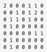
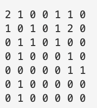

## 14502번 연구소

### 문제

인체에 치명적인 바이러스를 연구하던 연구소에서 바이러스가 유출되었다. 다행히 바이러스는 아직 퍼지지 않았고, 바이러스의 확산을 막기 위해서 연구소에 벽을 세우려고 한다.

연구소는 크기가 N×M인 직사각형으로 나타낼 수 있으며, 직사각형은 1×1 크기의 정사각형으로 나누어져 있다. 연구소는 빈 칸, 벽으로 이루어져 있으며, 벽은 칸 하나를 가득 차지한다. 

일부 칸은 바이러스가 존재하며, 이 바이러스는 상하좌우로 인접한 빈 칸으로 모두 퍼져나갈 수 있다. 새로 세울 수 있는 벽의 개수는 3개이며, 꼭 3개를 세워야 한다.

예를 들어, 아래와 같이 연구소가 생긴 경우를 살펴보자.



이때, 0은 빈 칸, 1은 벽, 2는 바이러스가 있는 곳이다. 아무런 벽을 세우지 않는다면, 바이러스는 모든 빈 칸으로 퍼져나갈 수 있다.

2행 1열, 1행 2열, 4행 6열에 벽을 세운다면 지도의 모양은 아래와 같아지게 된다.



바이러스가 퍼진 뒤의 모습은 아래와 같아진다.


벽을 3개 세운 뒤, 바이러스가 퍼질 수 없는 곳을 안전 영역이라고 한다. 위의 지도에서 안전 영역의 크기는 27이다.

연구소의 지도가 주어졌을 때 얻을 수 있는 안전 영역 크기의 최댓값을 구하는 프로그램을 작성하시오.

### 입력

첫째 줄에 지도의 세로 크기 N과 가로 크기 M이 주어진다. (3 ≤ N, M ≤ 8)

둘째 줄부터 N개의 줄에 지도의 모양이 주어진다. 0은 빈 칸, 1은 벽, 2는 바이러스가 있는 위치이다. 2의 개수는 2보다 크거나 같고, 10보다 작거나 같은 자연수이다.

빈 칸의 개수는 3개 이상이다.
### 출력

첫째 줄에 얻을 수 있는 안전 영역의 최대 크기를 출력한다.

### 예제 입력 1

```
7 7
2 0 0 0 1 1 0
0 0 1 0 1 2 0
0 1 1 0 1 0 0
0 1 0 0 0 0 0
0 0 0 0 0 1 1
0 1 0 0 0 0 0
0 1 0 0 0 0 0
```

### 예제 출력 1

```
27
```

### 예제 입력 2
```
4 6
0 0 0 0 0 0
1 0 0 0 0 2
1 1 1 0 0 2
0 0 0 0 0 2
```

### 예제 출력 2
```
9
```


### 예제 입력 3
```
8 8
2 0 0 0 0 0 0 2
2 0 0 0 0 0 0 2
2 0 0 0 0 0 0 2
2 0 0 0 0 0 0 2
2 0 0 0 0 0 0 2
0 0 0 0 0 0 0 0
0 0 0 0 0 0 0 0
0 0 0 0 0 0 0 0
```

### 예제 출력 3
```
3
```

### 코드

```python3
from sys import stdin
from collections import deque

n, m = map(int, stdin.readline().split())
board = []
virus_xy = []

for i in range(n):
    data = list(map(int, stdin.readline().split()))
    board.append(data)
    for j in range(len(data)):
        if data[j] == 2:
            virus_xy.append((i, j))

score = -1e9
dx, dy = [1, 0, 0, -1], [0, 1, -1, 0]


def get_score(board):
    global score
    cnt = 0
    for x in range(n):
        for y in range(m):
            if board[x][y] == 0:
                cnt += 1

    score = max(score, cnt)


def insfection(x, y, board):
    q = deque()
    q.append((x, y))

    while q:
        a, b = q.popleft()
        for i in range(4):
            # 다음 이동 좌표
            nx, ny = a + dx[i], b + dy[i]
            if -1 < nx < n and -1 < ny < m:
                if board[nx][ny] == 0:
                    # 감염시켜
                    board[nx][ny] = 2
                    q.append((nx, ny))


def solutions(cnt):
    # 울타리 세개 쳤니?
    if cnt == 3:
        new_board = [item[:] for item in board]
        for x, y in virus_xy:
            # 이제 바이러스가 감염을 시킬 시간
            insfection(x, y, new_board)
        
        # 구역 검사
        get_score(new_board)

    else:
        # 울타리 치러 ㄱㄱ
        for x in range(n):
            for y in range(m):
                # 울타리 칠 수 있는 곳이니?
                if board[x][y] == 0:
                    board[x][y] = 1
                    cnt += 1
                    # 울타리 하나 쳤으니까 재귀
                    solutions(cnt)
                    
                    # 울타리 하나 제거
                    cnt -= 1
                    board[x][y] = 0


solutions(0)
print(score)

```

BFS 를 사용해 푸는 골드 V 였습니다.

이 문제의 아이디어는


3개를 설치 - > 검사 -> 최대 점수 저장


을 반복하면 됩니다.

파이썬 같은 경우엔 속도가 다른 몇개의 언어보다 좀 느려서 그런지

pypy 가 아니면 통과를 못했습니다.