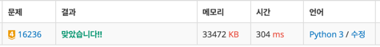

## 16236번 아기상어

### 문제

https://www.acmicpc.net/problem/16236


### 코드

```python3
from sys import stdin
import heapq
from collections import deque


n = int(stdin.readline().strip())
hq = []

board = []
shark_xy = (0, 0)
dx, dy = [1, 0, 0, -1], [0, 1, -1, 0]
shark_size = 2
shark_stack = 0

for i in range(n):
    data = list(map(int, stdin.readline().rstrip().split()))
    for j in range(n):
        if data[j] == 9:
            shark_xy = (i, j)
    board.append(data)

board[shark_xy[0]][shark_xy[1]] = 0


def bfs():
    dist = [[0] * n for _ in range(n)]

    q = deque()
    q.append(shark_xy)

    while q:
        x, y = q.popleft()
        for i in range(4):
            nx, ny = dx[i] + x, dy[i] + y
            if -1 < nx < n and -1 < ny < n:
                if dist[nx][ny] == 0 and board[nx][ny] <= shark_size:
                    dist[nx][ny] = dist[x][y] + 1
                    q.append((nx, ny))
                    if board[nx][ny] != 0 and board[nx][ny] < shark_size:
                        heapq.heappush(hq, [dist[x][y] + 1, nx, ny])


res = 0
while 1:
    bfs()
    if not hq:
        print(res)
        break
    else:
        dist, x, y = heapq.heappop(hq)
        res += dist
        board[x][y] = 0
        shark_stack += 1
        shark_xy = (x, y)
        hq = []

        if shark_stack >= shark_size:
            shark_stack = 0
            shark_size += 1


```


heapq (우선순위 큐)를 이용한

풀이 코드를 짜봤습니다.

방장님 코드에서 find만 사라졌습니다.

속도 차이가 얼마나 있을지 모르겠지만 굉장히 빨랐습니다.


