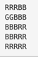

## 10026번 적녹색약

### 문제

적록색약은 빨간색과 초록색의 차이를 거의 느끼지 못한다. 따라서, 적록색약인 사람이 보는 그림은 아닌 사람이 보는 그림과는 좀 다를 수 있다.

크기가 N×N인 그리드의 각 칸에 R(빨강), G(초록), B(파랑) 중 하나를 색칠한 그림이 있다. 그림은 몇 개의 구역으로 나뉘어져 있는데, 구역은 같은 색으로 이루어져 있다. 또, 같은 색상이 상하좌우로 인접해 있는 경우에 두 글자는 같은 구역에 속한다. (색상의 차이를 거의 느끼지 못하는 경우도 같은 색상이라 한다)

예를 들어, 그림이 아래와 같은 경우에



적록색약이 아닌 사람이 봤을 때 구역의 수는 총 4개이다. (빨강 2, 파랑 1, 초록 1) 하지만, 적록색약인 사람은 구역을 3개 볼 수 있다. (빨강-초록 2, 파랑 1)

그림이 입력으로 주어졌을 때, 적록색약인 사람이 봤을 때와 아닌 사람이 봤을 때 구역의 수를 구하는 프로그램을 작성하시오.

### 입력

첫째 줄에 N이 주어진다. (1 ≤ N ≤ 100)

둘째 줄부터 N개 줄에는 그림이 주어진다.

### 출력

적록색약이 아닌 사람이 봤을 때의 구역의 개수와 적록색약인 사람이 봤을 때의 구역의 수를 공백으로 구분해 출력한다.

### 예제 입력 1

```
5
RRRBB
GGBBB
BBBRR
BBRRR
RRRRR
```

### 예제 출력 1

```
4 3
```


### 코드

```python3
from sys import stdin, setrecursionlimit
setrecursionlimit(10 ** 6)

n = int(stdin.readline().rstrip())
arr = []
for step in range(n):
    arr.append(list(stdin.readline().rstrip()))

nr_arr = [item[:] for item in arr]

for x in range(n):
    for y in range(n):
        
        # 적녹색약용 보드
        if arr[x][y] == 'R' or arr[x][y] == 'G':
            arr[x][y] = 1
        if arr[x][y] == 'B':
            arr[x][y] = 2
        
        # 일반 사람용 보드
        if nr_arr[x][y] == 'R':
            nr_arr[x][y] = 1
        elif nr_arr[x][y] == 'G':
            nr_arr[x][y] = 2
        if nr_arr[x][y] == 'B':
            nr_arr[x][y] = 3


def dfs(x, y, chk, normal=True):
    if x < 0 or y < 0 or x >= n or y >= n:
        return False

    if normal and nr_arr[x][y] == chk:
        # 중복 방문 방지
        nr_arr[x][y] = 9
        dfs(x - 1, y, chk)
        dfs(x, y - 1, chk)
        dfs(x + 1, y, chk)
        dfs(x, y + 1, chk)

        return True

    elif not normal and arr[x][y] == chk:
        # 중복 방문 방지
        arr[x][y] = 9
        dfs(x - 1, y, chk, False)
        dfs(x, y - 1, chk, False)
        dfs(x + 1, y, chk, False)
        dfs(x, y + 1, chk, False)

        return True

    return False


nr, rg = 0, 0
for chk in range(1, 4):
    for x in range(n):
        for y in range(n):
            # 구역 검사
            if dfs(x, y, chk):
                nr += 1
            
            # 구역 검사
            if dfs(x, y, chk, False):
                rg += 1

print(nr, rg)

```

정상인과 적녹색약인 사람 따로 DFS 돌려주면 되는 문제입니다.


