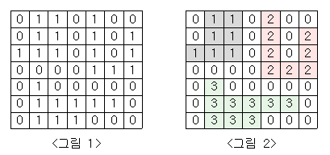

## 2667번 단지번호붙이기

### 난이도

실버1

### 문제

<그림 1>과 같이 정사각형 모양의 지도가 있다. 1은 집이 있는 곳을, 0은 집이 없는 곳을 나타낸다. 철수는 이 지도를 가지고 연결된 집의 모임인 단지를 정의하고, 단지에 번호를 붙이려 한다. 여기서 연결되었다는 것은 어떤 집이 좌우, 혹은 아래위로 다른 집이 있는 경우를 말한다. 대각선상에 집이 있는 경우는 연결된 것이 아니다. <그림 2>는 <그림 1>을 단지별로 번호를 붙인 것이다. 지도를 입력하여 단지수를 출력하고, 각 단지에 속하는 집의 수를 오름차순으로 정렬하여 출력하는 프로그램을 작성하시오.


### 입력

첫 번째 줄에는 지도의 크기 N(정사각형이므로 가로와 세로의 크기는 같으며 5≤N≤25)이 입력되고, 그 다음 N줄에는 각각 N개의 자료(0혹은 1)가 입력된다.

### 출력

첫 번째 줄에는 총 단지수를 출력하시오. 그리고 각 단지내 집의 수를 오름차순으로 정렬하여 한 줄에 하나씩 출력하시오.

### 예제 입력 1 복사

```
7
0110100
0110101
1110101
0000111
0100000
0111110
0111000
```

### 예제 출력 1 복사

```
3
7
8
9
```

### 풀이

대표적인 BFS문제이다. 큐를 이용하여 문제를 해결한다.
x,y를 큐에 저장, bfs함수를 실행한다는건 값이 1이란 증거이므로,
graph[x][y]를 0으로 체크해준다. 이후 while문을 큐만큼 실행하게 되는데, 이때 while문을 탈때마다 x,y를 큐에서 제거 해준다. for문은 4번을 돌리는데 이유는 상,하,좌,우 즉 주변에 연결된 값들을 확인하고 뽑아내야 되기 때문이다. 이 for문에서는
x,y의 상,하,좌,우를 dx,dy로 미리설정한 값을 x,y를 더해
바로옆의 값들을 nx,ny로 설정해주었고, 이후 1번째 if문은
해당범위에 대한 설정을, 2번째 if문은 nx,ny 즉 x,y의 옆의 값이 1이면 이또한 0으로 체크해준후 큐에 해당값들을 더해준다.
그리고 count를 증가시킨다.
다시한번 요약해서 이 큐를 사용하는 이유는
for문은 바로 1인 상,하,좌,우 값들을 찾기위한거고 그값들이
1이 맞다면 해당 좌표[nx][ny]를 큐에 쌓아서 다시 그 값들의 주변값들의 1의 유무를 확인하며 계속 0이 나올때까지 진행하기 위함이다. popleft는 해당좌표를 체크했으면 더이상 주변좌표를 검색하다보면 곂칠때가 있는데 이것을 대처하기 위함이다.
javaScript는 생각보다 어려웠는데, 어려웠던 점을 몇개 나열하면

1. js 큐는 인자를(x,y)가 아닌 [x,y]로 담는다.
2. python에서는 popleft, javascript에선 shift
3. js는 popleft 즉 shift시 const target값이 변수에 값을저장해야한다.
4. while문에서 queue뿐만아니라 queue.length로 해야한다.
