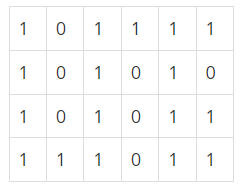

## 2178번 미로 탐색

### 난이도

> 실버1

### 문제

N×M크기의 배열로 표현되는 미로가 있다.



미로에서 1은 이동할 수 있는 칸을 나타내고, 0은 이동할 수 없는 칸을 나타낸다. 이러한 미로가 주어졌을 때, (1, 1)에서 출발하여 (N, M)의 위치로 이동할 때 지나야 하는 최소의 칸 수를 구하는 프로그램을 작성하시오. 한 칸에서 다른 칸으로 이동할 때, 서로 인접한 칸으로만 이동할 수 있다.

위의 예에서는 15칸을 지나야 (N, M)의 위치로 이동할 수 있다. 칸을 셀 때에는 시작 위치와 도착 위치도 포함한다.

### 입력

첫째 줄에 두 정수 N, M(2 ≤ N, M ≤ 100)이 주어진다. 다음 N개의 줄에는 M개의 정수로 미로가 주어진다. 각각의 수들은 붙어서 입력으로 주어진다.

### 출력

첫째 줄에 지나야 하는 최소의 칸 수를 출력한다. 항상 도착위치로 이동할 수 있는 경우만 입력으로 주어진다.

### 예제 입력 1 복사

```
4 6
101111
101010
101011
111011
```

### 예제 출력 1 복사

```
15
```

### 예제 입력 2 복사

```
4 6
110110
110110
111111
111101
```

### 예제 출력 2 복사

```
9
```

### 예제 입력 3 복사

```
2 25
1011101110111011101110111
1110111011101110111011101
```

### 예제 출력 3 복사

```
38
```

### 풀이

bfs를 이용하여 시작점부터 가까운 노드를 차례로 탐색하면된다.
사작좌표 x,y를 입력하면 bfs 함수는 x,y좌표를 큐에 입력한다
while문을 통해 큐안에 데이터가 존해할때까지 반복하게하는데
반복을 시작할때 맨 처음 큐에 있는 데이터를 삭제한다.
그리고 x,y를 기준으로 1옆, 즉 상,하,좌,우 등 4방향으로 체크한다
그 체크한 값을 nx,ny로 지정하는데, 만약에 graph[nx][ny]값,
즉 x,y에 1칸 주위에 4방향중 어떤값이 1이라면,
그 노드, 어떤값, 즉 graph[nx][ny]는 graph[x][y]+1 값을 더한다
이 과정을 한번더 요약해서 설명하면 즉,
x,y 1칸주변 4방향의 값이 1이면 그 값의 데이터는 x,y좌표에
데이터 +1 이다. 시작점x,y가 처음엔 1이므로 다음에는 2가 되는것이다
이후 nx,ny를 큐에 저장해주면서 nx,ny 가 x,y로 되게 하고
위 과정을 다시 밣아 x,y를 큐에서 다시 제거함으로써 주변 값을 다시 확인한다.
이를 반복하면 원하는 데이터가 나온다
